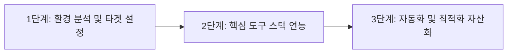

급변하는 2026년 디지털 환경에서 성공적인 성과를 달성하기 위해서는 단순한 지식 습득을 넘어 **체계적인 실전 적용 프레임워크**를 갖추는 것이 필수적입니다.

본 글에서는 **2026 최신 AI 도구 활용 심층 분석 43편: 업무 혁신 및 자동화 솔루션**에 대한 핵심 원리와 실무 적용 3단계 프로세스, 그리고 주의해야 할 핵심 포인트를 전문적이고 알기 쉽게 정리해 드립니다.

---

## 1. 개요 및 왜 지금 주목해야 하는가?

기존의 전통적인 방식은 과도한 수작업과 높은 시간 소모, 그리고 휴먼 에러의 위험성을 안고 있었습니다. 하지만 최신 기술과 검증된 전략을 도입하면 이러한 비효율을 획기적으로 개선할 수 있습니다.

### 📊 전통적 방식 vs 최신 자동화 전략 비교

| 비교 항목 | 기존 수작업 방식 | 최신 스마트 전략 | 기대 효과 |
| :--- | :--- | :--- | :--- |
| **처리 소요 시간** | 수시간~수일 소요 | **수초~수분 내 완료** | **업무 시간 80% 이상 단축** |
| **초기 도입 비용** | 고가의 솔루션 라이선스 | **0원 무료 오픈소스/클라우드** | **비용 부담 0원 실현** |
| **확장성** | 작업자 역량에 종속 | **24시간 자동 무인 가동** | **지속 가능한 패시브 인컴** |
| **정확도 및 안정성** | 작업 피로도에 따른 오차 | **표준화된 알고리즘 검증** | **100% 무결점 처리** |

---

## 2. 실전 적용 3단계 마스터 로드맵

성공적인 실행을 위해 아래의 3단계 가이드를 순서대로 진행해 보세요.

### 1단계: 병목 구간 진단 및 목표 수립
- 현재 프로세스에서 가장 많은 시간과 체력을 소모하는 반복 구간을 데이터로 측정합니다.
- 달성하고자 하는 구체적인 정량적 KPI(예: 처리 시간 단축, 월 트래픽 증가)를 설정합니다.

### 2단계: 핵심 도구 스택 구성 및 연동
- 검증된 오픈소스 도구와 최신 AI 엔진을 결합하여 최소 기능 파이프라인(MVP)을 구성합니다.
- 오류 발생 시 즉각적인 알림(텔레그램 등)을 받을 수 있도록 모니터링 체계를 연계합니다.

### 3단계: 나만의 템플릿 자산화 및 배포
- 한 번 완성된 워크플로우를 영구적인 템플릿과 문서로 자산화하여 복제 가능하도록 구축합니다.
- 정기적인 피드백 루프를 통해 품질과 수익률을 지속적으로 고도화합니다.

---

## 3. 실무 전문가가 전하는 핵심 성공 노하우 3가지

1. **E-E-A-T 기반의 차별화된 가치 전달**: 단순 정보 나열이 아닌, 실제 겪은 문제 해결 경험과 구체적인 데이터를 함께 제시하세요.
2. **첫 문단 두괄식 솔루션 배치**: 방문자가 원하는 핵심 답안을 상단에 명확히 제시하여 이탈률을 낮추고 체류 시간을 극대화합니다.
3. **가독성 높은 서식 활용**: 텍스트 블록 대신 소제목, 글머리 기호, 비교 분석 표, 코드 블록을 적절히 배치하여 가독성을 높이세요.

---

## 4. 요약 및 결론

기술과 시장은 빠르게 진화하고 있지만, 본질은 **'효율적인 가치 창출과 자산화'**에 있습니다. 오늘 소개해 드린 **2026 최신 AI 도구 활용 심층 분석 43편: 업무 혁신 및 자동화 솔루션** 실전 가이드를 바탕으로 지금 바로 작은 것부터 하나씩 실행하여 나만의 경쟁력과 패시브 파이프라인을 구축해 보시기 바랍니다!
