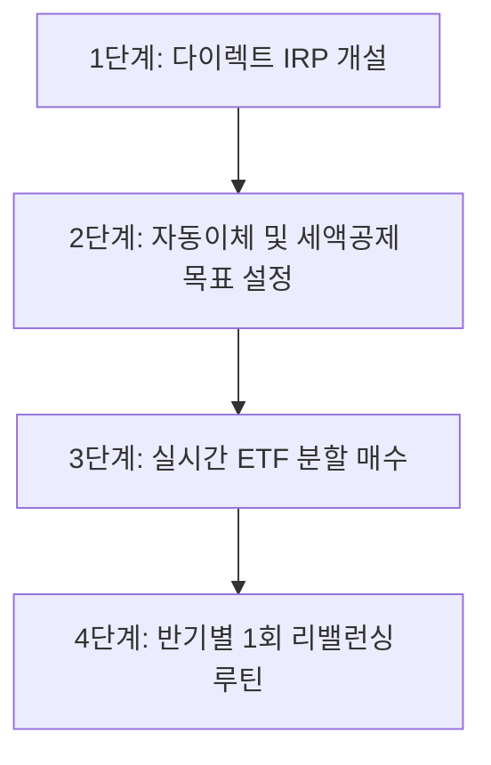

매년 연말정산 시즌마다 '13월의 월급'을 기대했다가 오히려 세금을 토해내며 허탈함을 느끼신 적이 있으신가요? 치솟는 물가와 불안정한 경기 속에서 월급만으로 자산을 증식하기란 결코 쉽지 않습니다. 하지만 합법적이면서도 확정적인 고수익을 안겨주는 재테크 도구가 있습니다. 바로 **개인형 퇴직연금(IRP, Individual Retirement Pension)**입니다.

IRP는 단순한 노후 보장용 계좌가 아닙니다. 납입 즉시 최대 16.5%의 확정 세액공제 수익을 챙기고, 계좌 내에서 글로벌 지수 ETF에 투자해 발생하는 매매차익과 배당금에 대한 과세를 은퇴 시점까지 이연시킬 수 있는 가장 강력한 고단가 재테크 무기입니다.

본 글에서는 **IRP 세액공제 한도와 실수령 환급액 계산법**, **안전자산 30% 규정을 영리하게 돌파하는 ETF 포트폴리오 구성법**, 그리고 **초보자도 오늘 당장 실행할 수 있는 단계별 실천 루틴**을 상세히 정리해 드립니다.

---

## 1. IRP 세액공제 한도와 절세 원리 분석

IRP의 가장 직관적인 매력은 납입 금액에 비례하여 연말정산 시 현금으로 돌려받는 **세액공제 혜택**입니다.

### 소득 구간별 세액공제 한도 및 환급액
현재 세법상 연금계좌(연금저축 + IRP)의 연간 세액공제 납입 한도는 **합산 최대 900만 원**입니다. 연금저축 단독으로는 최대 600만 원까지만 공제 대상이 되므로, 한도 900만 원을 꽉 채워 절세 효과를 극대화하려면 반드시 IRP에 최소 300만 원 이상을 납입해야 합니다.

소득 수준에 따른 세액공제율과 실제 환급액 차이는 다음과 같습니다.

| 구분 | 총급여 5,500만 원 이하 (종합소득 4,500만 원 이하) | 총급여 5,500만 원 초과 (종합소득 4,500만 원 초과) |
| :--- | :---: | :---: |
| **연간 세액공제 한도** | 900만 원 | 900만 원 |
| **적용 공제율** | **16.5%** (지방소득세 포함) | **13.2%** (지방소득세 포함) |
| **최대 세액 환급액** | **1,485,000원** | **1,188,000원** |
| **월 환산 필요 저축액** | 월 75만 원 | 월 75만 원 |

> **💡 핵심 포인트:** 총급여 5,500만 원 이하 근로자가 연간 900만 원을 IRP에 납입하면, 연말정산 시 **148만 5,000원**이 통장으로 환급됩니다. 이는 무위험 확정 수익률 **16.5%**를 확보하고 재테크를 시작하는 것과 동일합니다.

### 해외 ETF 투자 시 누리는 '과세이연'의 복리 마법
일반 주식 위탁계좌에서 미국 S&P500이나 나스닥100 ETF를 거래하면 매매차익과 배당금에 대해 **15.4%의 배당소득세**가 즉시 원천징수되며, 금융소득이 2,000만 원을 넘기면 금융소득종합과세 대상이 됩니다.

반면 IRP 계좌 내에서 국내 상장 해외 ETF에 투자할 경우:
1. **과세이연**: 매도 차익과 분배금에 대해 거래 시점에 세금을 떼지 않고 원금에 재투자되므로 복리 효과가 극대화됩니다.
2. **저율 과세**: 만 55세 이후 연금 형태로 분할 수령 시 15.4% 대신 **3.3% ~ 5.5%의 저율 연금소득세**만 적용됩니다.

---

## 2. IRP 규정 정복: 안전자산 30% 룰과 돌파 전략

IRP를 처음 운용하는 투자자들이 가장 곤혹스러워하는 부분이 바로 **'위험자산 투자한도 70% 제한 규정'**입니다. 퇴직연금 감독규정상 계좌 평가금액의 최소 30%는 반드시 '안전자산'으로 채워야 합니다.

- **위험자산(최대 70%)**: 순수 주식형 ETF(미국 S&P500, 나스닥100, 반도체 테마 등)
- **안전자산(최소 30%)**: 예적금, 국공채 채권형 ETF, 원리금보장형 ELB, 채권혼합형 ETF, 적격 TDF

많은 분들이 30%의 안전자산을 금리가 낮은 정기예금에 방치하여 수익률을 갉아먹곤 합니다. 하지만 ETF 상품을 적절히 조합하면 안전자산 30% 비중에서도 훌륭한 자본 수익을 추구할 수 있습니다.

### 안전자산 30%를 스마트하게 채우는 3가지 방법
1. **채권혼합형 ETF 활용 (주식 비중 극대화)**: 주식 40% + 채권 60%로 구성된 '채권혼합형 ETF'(예: TIGER 미국나스닥100TR채권혼합Fn)는 규정상 안전자산으로 분류됩니다. 이를 30% 채우면 계좌 전체의 실질 주식 노출도를 약 82%(70% + 12%)까지 끌어올릴 수 있습니다.
2. **미국 장기 국채 ETF (헤지 효과)**: 주식 시장 하락 시 반등하는 미국 30년 국채 관련 ETF를 편입하여 전체 포트폴리오의 변동성을 낮추고 안정성을 확보합니다.
3. **금(Gold) 현물 ETF**: 인플레이션 헷지 자산이자 안전자산으로 인정받는 'ACE KRX금현물 ETF'를 10~15% 편입하여 시장 충격을 방어합니다.

---

## 3. 실전 IRP ETF 투자 포트폴리오 2선

투자 성향과 은퇴까지 남은 기간에 맞춰 즉시 복사해서 적용할 수 있는 실전 포트폴리오 2가지를 제안합니다.

### Model A. 공격적 성장형 포트폴리오 (2040 직장인 추천)
자산 형성기 직장인을 위해 글로벌 우량 기업의 주가 상승 과실을 최대한 누릴 수 있도록 구성한 모델입니다.

| 구분 | 자산 분류 | 추천 종목 예시 | 추천 비중 |
| :--- | :--- | :--- | :---: |
| **위험자산 (70%)** | 미국 대표지수 | TIGER 미국S&P500 / ACE 미국S&P500 | 40% |
| | 글로벌 테크 성장 | TIGER 미국나스닥100 / KODEX 미국나스닥100TR | 20% |
| | 차세대 혁신 산업 | KODEX 미국반도체MV / TIGER 미국빅테크TOP10 | 10% |
| **안전자산 (30%)** | 주식채권 혼합 | TIGER 미국나스닥100TR채권혼합Fn | 20% |
| | 인플레이션 헷지 | ACE KRX금현물 | 10% |

### Model B. 올웨더 안정 분산형 포트폴리오 (변동성 최소화)
은퇴 시점이 가깝거나 주식 시장의 급락이 두려운 안정 추구형 투자자를 위한 방어형 모델입니다.

| 구분 | 자산 분류 | 추천 종목 예시 | 추천 비중 |
| :--- | :--- | :--- | :---: |
| **위험자산 (70%)** | 미국 핵심 자산 | TIGER 미국S&P500 / ACE 미국S&P500 | 45% |
| | 글로벌 배당성장 | SOL 미국배당다우존스 / TIGER 미국배당다우존스 | 25% |
| **안전자산 (30%)** | 미국 장기채권 | ACE 미국30년국채액티브(H) | 20% |
| | 단기 유동성/파킹 | KODEX CD금리액티브 / TIGER KOFR금리액티브 | 10% |

---

## 4. 초보자를 위한 IRP ETF 매매 4단계 실행 가이드

계좌 개설부터 실제 매수까지의 전체 과정을 단계별로 정리했습니다.

### STEP 1. 모바일 증권사 '다이렉트 IRP' 비대면 개설
시중 은행이나 구형 증권사 창구에서 가입할 경우 연 0.2%~0.4%의 운용·자산관리 수수료가 매년 차감됩니다. 반드시 모바일 앱을 통해 **운용·자산관리 수수료가 평생 전액 면제되는 '다이렉트 IRP'**를 개설하세요. (미래에셋, 한국투자, 삼성, KB, 키움, NH 등 대형 증권사 대부분 비대면 수수료 무료 지원)

### STEP 2. 자동이체 설정 및 납입 스케줄 수립
연말에 한 번에 900만 원을 몰아서 넣으려면 목돈 부담이 큽니다. 매월 급여일에 맞춰 **월 25만 원(연 300만 원, 연금저축 병행 시)** 또는 **월 75만 원(연 900만 원 단독 납입 시)** 자동이체를 걸어두세요.

### STEP 3. 실시간 ETF 분할 매수 노하우
- **매매 시간 준수**: 장 시작 직후(09:00~09:20)와 장 마감 직전(15:10~15:30)은 가격 변동성이 크고 괴리율이 벌어질 수 있으므로, LP(유동성공급자)의 호가 공급이 원활한 **오전 10시 ~ 오후 3시 사이**에 매수하세요.
- **적립식 매수**: 매월 정해진 날짜에 동일한 금액으로 매수하여 '코스트 에버리지(매입단가 평준화)' 효과를 누립니다.

### STEP 4. 반기(6개월) 1회 리밸런싱
주식형 ETF 가격이 크게 상승하면 계좌 내 위험자산 비중이 70%를 초과할 수 있습니다. IRP는 위험자산이 70%를 초과하더라도 기존 보유분을 강제로 매도하지는 않지만, 신규로 주식형 ETF를 추가 매수할 수 없게 됩니다. 매년 6월과 12월에 비중을 확인하고 차익 실현 후 안전자산을 채우거나, 반대로 하락한 자산을 추가 매수하는 리밸런싱을 진행하세요.

---

## 5. 수익 극대화 및 리스크 관리 핵심 체크포인트

IRP는 강력한 절세 무기이지만, 계약 조건과 출금 제약이 엄격한 금융상품입니다. 다음 3가지는 반드시 숙지해야 합니다.

1. **중도해지 시 16.5% 기타소득세 추징**  
   IRP를 만 55세 이전 무단 해지하면, 지금까지 세액공제받았던 납입 원금과 계좌 내 운용수익 전액에 대해 **16.5%의 기타소득세**가 부과됩니다. 절세 혜택이 고스란히 박탈될 수 있으므로, 반드시 여유 자금으로만 납입해야 합니다.
   > *예외적 중도인출 사유: 무주택자의 생애 최초 주택 구입, 6개월 이상 요양을 요하는 본인/부양가족의 질병, 개인회생·파산 등 법정 사유 시에만 낮은 세율로 일부 인출이 가능합니다.*

2. **세액공제 미신청 금액의 자유로운 인출 팁**  
   연간 납입한도(최대 1,800만 원) 중 세액공제 한도 900만 원을 초과하여 입금한 금액은 세액공제 혜택을 받지 않은 순수 원금입니다. 이 금액은 해지 페널티(16.5%) 없이 언제든지 비과세로 자유롭게 인출할 수 있습니다.

3. **만 55세 이후 연금 수령 한도 관리**  
   만 55세 이후 연금을 개시할 때 연간 사적연금 수령액이 **1,500만 원(기존 1,200만 원에서 상향)**을 초과하면 종합과세 또는 16.5% 분리과세 중 선택해야 합니다. 3.3%~5.5%의 저율 과세 혜택을 온전히 누리려면 연금 수령 기간을 10년 이상으로 길게 분산하여 연간 수령액이 1,500만 원 이하가 되도록 인출 플랜을 설계하세요.

---

## 6. 결론: 오늘 바로 실행하는 IRP 자산 증식 로드맵

IRP 세액공제와 ETF 적립식 투자는 단기적인 테마주 매매보다 훨씬 안전하고 검증된 부의 축적 방정식입니다.

- **3줄 핵심 요약**
  1. IRP는 연 최대 900만 원 납입 시 소득에 따라 **118.8만 원 ~ 148.5만 원**의 확정 세액환급을 제공합니다.
  2. 계좌 내 해외 ETF 투자 시 **15.4% 배당소득세 과세이연** 및 은퇴 후 **3.3%~5.5% 저율 연금소득세** 혜택을 누립니다.
  3. **안전자산 30% 룰**은 채권혼합형 ETF나 금현물 ETF를 활용해 실질 주식 노출도와 자산 배분 효과를 동시에 달성할 수 있습니다.

미래의 풍요로운 은퇴와 당장 올해 연말정산의 두둑한 환급금을 원하신다면 미루지 마세요. 오늘 바로 주거래 증권사 앱을 켜고 **수수료 없는 다이렉트 IRP 계좌**를 개설한 후, 월 25만 원씩 미국 지수 ETF 자동 매수를 시작해 보시기 바랍니다!
