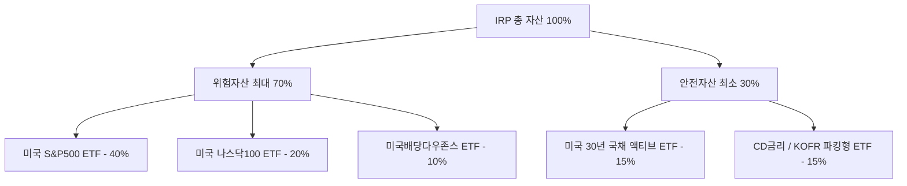

## 서론: 13월의 월급을 만드는 가장 확실한 무기, IRP

연말정산 시즌만 되면 "또 세금을 토해냈다"라며 한숨 쉬는 직장인과 프리랜서 분들이 많습니다. 열심히 일해 번 소득이지만, 제대로 된 절세 전략이 없다면 합법적으로 챙길 수 있는 환급금마저 고스란히 국가에 반납하게 됩니다. 

이때 반드시 주목해야 할 제도가 바로 **IRP(개인형 퇴직연금, Individual Retirement Pension)**입니다. IRP는 단순한 노후 대비용 퇴직연금 계좌가 아닙니다. 1년에 최대 **148만 5,000원**을 돌려받을 수 있는 현존 최강의 절세 계좌이자, 글로벌 우량 자산에 투자해 복리 효과를 누릴 수 있는 강력한 투자 플랫폼입니다.

하지만 대다수 투자자가 IRP의 까다로운 **'위험자산 70% 제한 규정'**과 상품 선택의 복잡성 때문에 원리금보장형 정기예금에 방치해 두곤 합니다. 물가상승률조차 따라가지 못하는 연 2~3%대 금리에 머물러 있다면 사실상 자산이 줄어들고 있는 셈입니다.

이번 포스팅에서는 **IRP 세액공제 한도와 소득 구간별 환급 원리**를 명확히 짚어보고, 규제를 영리하게 활용하여 기대수익률을 극대화하는 **실전 ETF 포트폴리오 구축법**을 아낌없이 공개합니다.

---

## 1. IRP 세액공제 한도 및 환급 원리 완벽 분석

IRP의 가장 매력적인 혜택은 단연 납입액에 대해 확정적인 세금을 깎아주는 **세액공제(Tax Credit)**입니다. 

### 2026년 기준 연금계좌 납입 및 공제 한도 매트릭스
현재 세법상 연금저축과 IRP를 합산한 연간 세액공제 대상 납입 한도는 **최대 900만 원**입니다. 단, 계좌별로 다음과 같은 한도 규칙이 적용됩니다.

* **연금저축 단독**: 최대 600만 원까지 공제 인정
* **IRP 단독**: 단독으로 900만 원 전액 공제 인정
* **연금저축 + IRP 결합**: 연금저축에서 600만 원을 채우고, IRP에서 추가 300만 원을 채워 총 900만 원 한도 달성

### 소득 구간별 환급액 비교
세액공제율은 근로자의 총급여(또는 종합소득금액)에 따라 16.5%와 13.2%의 두 구간으로 나뉩니다.

| 구분 | 총급여 5,500만 원 이하 (종합소득 4,500만 원 이하) | 총급여 5,500만 원 초과 (종합소득 4,500만 원 초과) |
| :--- | :--- | :--- |
| **지방소득세 포함 공제율** | **16.5%** | **13.2%** |
| **최대 납입 인정액** | 900만 원 | 900만 원 |
| **연말정산 최대 환급액** | **1,485,000원** | **1,188,000원** |
| **월 환산 필요 납입액** | 월 750,000원 | 월 750,000원 |

> [!TIP]
> **확정 수익률 관점에서의 접근**
> 900만 원을 납입하고 148만 5,000원을 환급받는다는 것은, 투자 첫해에 시장 변동성과 상관없이 **무조건 16.5%의 확정 수익**을 깔고 시작한다는 뜻입니다. 어떠한 고위험 주식 투자도 첫해 16.5%의 무위험 확정 수익을 보장하지 못합니다.

---

## 2. 연금저축 vs IRP: 황금 비율 납입 전략

많은 분이 "연금저축펀드와 IRP 중 어디에 돈을 넣어야 하나요?"라고 묻습니다. 결론부터 말씀드리면, **'연금저축 600만 원 선(先)납입 후, IRP 300만 원 추가 납입'** 공식이 자금 운용상 가장 유리합니다.

### 두 계좌의 핵심 차이점 비교

| 비교 항목 | 연금저축펀드 | IRP (개인형 퇴직연금) |
| :--- | :--- | :--- |
| **가입 대상** | 누구나 가입 가능 (소득 무관) | 소득이 있는 근로자, 자영업자 등 |
| **세액공제 한도** | 최대 600만 원 | 최대 900만 원 (연금저축 합산) |
| **위험자산 투자 한도** | **100% 전액 주식형 ETF 가능** | **최대 70% 제한 (안전자산 30% 의무)** |
| **운용 관리 수수료** | 대부분 무료 | 증권사 비대면 개설 시 무료 (일부 유료) |
| **중도 인출** | 세액공제 안 받은 원금은 자유 인출 | 법정 사유(파산, 무주택자 주택구입 등) 외 인출 불가 |
| **담보 대출** | 가능 | 불가능 |

### 왜 연금저축을 먼저 채워야 할까요?
연금저축은 주식 비중을 100%까지 채울 수 있어 장기 성장성이 뛰어난 주식형 ETF를 적극적으로 담기에 적합합니다. 반면 IRP는 법적으로 30%의 안전자산을 반드시 편입해야 하며, 중도 인출이 극도로 까다롭습니다.

따라서 유동성과 공격적 투자가 가능한 **연금저축에 먼저 600만 원**을 채우고, 추가 세액공제 혜택 300만 원을 온전히 누리기 위해 **IRP에 300만 원을 배분**하는 것이 가장 합리적인 자산 배분 전략입니다.

---

## 3. 위험자산 70% 규정을 뚫는 실전 ETF 포트폴리오

IRP 계좌의 가장 큰 숙제는 **'안전자산 30% 의무 편입 규정'**입니다. 전체 자산의 30% 이상을 채권, 예적금, TDF 등 적격 안전자산에 배분해야 매수가 체결됩니다.

하지만 안전자산이라고 해서 금리 2~3%짜리 정기예금만 고집할 필요는 전혀 없습니다. 채권혼합형 ETF나 타깃데이트펀드(TDF), 금리연동형 ETF를 활용하면 30%의 안전자산 내에서도 시장 방어와 알파 수익을 동시에 챙길 수 있습니다.

### 모델 포트폴리오 1: 표준 성장형 (추천: 직장인 3040 세대)
자산 증식이 필요한 장기 투자자에게 최적화된 포트폴리오입니다.

1. **위험자산군 (70%)**
   * **미국 S&P500 지수 추종 ETF (40%)**: 자본주의의 심장인 미국 대표 500개 우량 기업 분산 투자 (예: TIGER 미국S&P500, ACE 미국S&P500 등)
   * **미국 나스닥100 ETF (20%)**: 빅테크 및 AI 혁신 성장주를 통한 초과 수익 추구 (예: TIGER 미국나스닥100, KODEX 미국나스닥100TR)
   * **미국배당다우존스 ETF (10%)**: 안정적인 분배금 재투자와 하방 경직성을 위한 SCHD 한국판 ETF

2. **안전자산군 (30%)**
   * **미국 30년 국채 액티브(H) ETF (15%)**: 금리 인하기 자본차익을 노릴 수 있으며 안전자산으로 100% 인정되는 장기 국채 ETF
   * **CD금리투자 KIS / KOFR 금리연동 ETF (15%)**: 손실 위험 없이 일복리로 이자가 쌓이는 파킹형 ETF로, 시장 급락 시 저가 매수를 위한 현금 버퍼 역할 수행

### 모델 포트폴리오 2: 은퇴 대비 안정 배당형 (추천: 50대 이상)
은퇴 시점이 가깝다면 변동성을 낮추고 현금흐름을 확보해야 합니다.

* **위험자산 (70%)**: 미국배당다우존스(40%) + 미국 S&P500(30%)
* **안전자산 (30%)**: TDF 2030/2035(20%) + 우량 단기채권 액티브 ETF(10%)

> [!NOTE]
> **TDF(Target Date Fund)의 마법**
> 은퇴 목표 시점에 맞춰 주식과 채권 비중을 알아서 조절해 주는 TDF 중 일부(주식 비중 80% 미만 충족 상품)는 IRP 내에서 **'안전자산'으로 분류**됩니다. 즉, 안전자산 30%를 TDF로 채우면 실질적으로 전체 계좌 내 주식 노출도를 70% 이상으로 끌어올리는 효과를 누릴 수 있습니다.

---

## 4. 수익 극대화와 리스크 관리 3대 핵심 체크포인트

성공적인 IRP 투자를 위해 반드시 기억해야 할 실전 체크리스트입니다.

### ① 과세이연과 저율 분리과세의 복리 마법
일반 계좌에서 해외주식형 ETF를 매매하면 차익의 15.4%가 배당소득세로 원천징수되며, 금융소득종합과세 대상이 될 수 있습니다. 반면 IRP 내에서는 **세금을 즉시 떼지 않고 전액 재투자(과세이연)**됩니다. 
훗날 55세 이후 연금으로 수령할 때 3.3%~5.5%의 저율 연금소득세만 부과되므로 복리 효과가 극대화됩니다.

### ② 주기적 리밸런싱(Rebalancing)
주가가 급등하면 위험자산 비중이 70%를 초과할 수 있습니다. IRP는 기존 보유분이 70%를 넘어도 강제 매도시키지는 않지만, 추가 매수가 불가능해집니다. 
반기(6개월) 또는 연 1회 계좌를 점검하여, 비중이 커진 주식형 ETF의 이익을 실현하고 저평가된 안전자산이나 채권을 사 모으는 기계적 리밸런싱을 실천하세요.

### ③ 중도 해지 리스크와 패널티
IRP의 세액공제는 '55세 이후 연금 수령'을 조건으로 주는 혜택입니다. 중도 해지 시 **그동안 감면받은 세액공제 혜택과 운용 수익 전체에 대해 16.5%의 기타소득세가 추징**됩니다. 배보다 배꼽이 더 커질 수 있으므로, 반드시 5년 이상 묶어둘 수 있는 여유 자금으로만 납입해야 합니다.

---

## 5. 초보자를 위한 3단계 즉시 실행 로드맵

1. **1단계: 수수료 무료 증권사 비대면 개설**
   시중 은행의 IRP는 연 0.2~0.4% 수준의 운용·자산관리 수수료를 떼어갑니다. 미래에셋증권, 한국투자증권, 삼성증권 등 주요 증권사 모바일 앱에서 **'다이렉트 비대면 IRP'**를 개설하면 평생 운용 수수료가 전액 면제됩니다.

2. **2단계: 목표 납입 방식 설정 (자동이체 vs 연말 몰아넣기)**
   연말에 목돈 300만 원이나 900만 원을 한 번에 넣으려면 부담이 큽니다. 매월 25일 급여일에 맞춰 25만~75만 원씩 자동이체를 걸어두고 코스트 애버리지(분할 매수) 효과를 노리는 것을 권장합니다.

3. **3단계: TR(Total Return) 또는 분배금 재투자 설정**
   배당금이 발생했을 때 계좌 내 예수금으로 잠자지 않도록, 정기적으로 배당금을 모아 S&P500이나 단기채 ETF를 1주씩 재매수하세요.

---

## 결론: 부자가 되는 연금 습관

* **1줄 요약**: IRP는 최대 900만 원 한도로 연 최대 148만 5,000원의 세금을 환급해 주는 독보적인 절세 수단입니다.
* **2줄 요약**: 연금저축 600만 원을 먼저 채운 후 IRP 300만 원을 채우고, 70:30 룰을 활용해 S&P500과 채권·TDF로 포트폴리오를 구성하세요.
* **3줄 요약**: 과세이연 혜택을 온전히 누리며 복리로 불려 나가되, 16.5% 해지 패널티가 있으므로 철저히 장기전으로 접근해야 합니다.

망설이는 동안에도 시간과 복리의 기회는 흘러갑니다. 지금 바로 증권사 앱을 켜고 비대면 IRP 계좌를 개설한 뒤, 첫 10만 원 자동이체부터 시작해 보세요!
