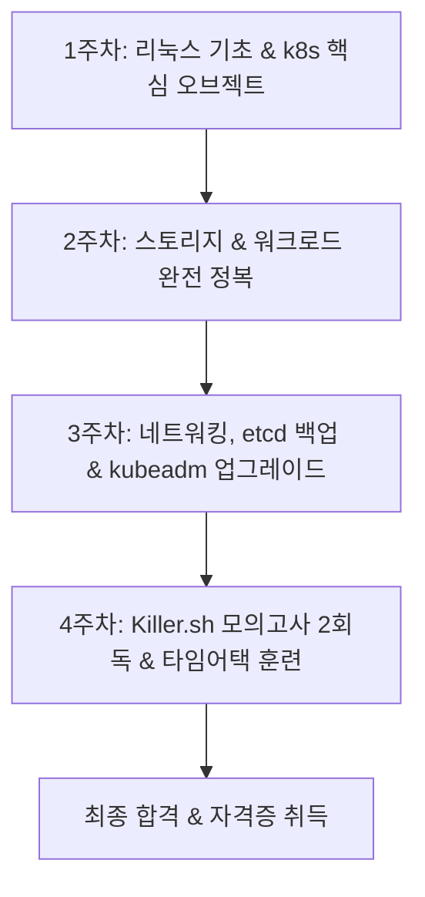

클라우드 네이티브 기술이 엔터프라이즈 인프라의 표준으로 자리 잡으면서 **쿠버네티스(Kubernetes, K8s)** 역량은 개발자와 인프라 엔지니어 모두에게 가장 강력한 무기가 되었습니다. 특히 리눅스 파운데이션(The Linux Foundation)과 CNCF가 주관하는 **CKA(Certified Kubernetes Administrator)** 자격증은 단순한 이론 객관식 시험이 아닌 100% 실기형 터미널 랩 환경에서 치러지기 때문에, 취득 즉시 업계에서 실무 실행력을 증명하는 공인 보증수표로 인정받습니다.

하지만 비전공자나 비인프라 직군 개발자에게 터미널 검은 화면에서 수십 개의 클러스터를 조작하는 CKA 시험은 거대한 장벽처럼 느껴지기 마련입니다. 복잡한 네트워크 모델, 낯선 YAML 문법, 그리고 영문으로 주어지는 까다로운 문제들은 시작 전부터 큰 부담을 줍니다.

걱정하지 마세요. CKA는 방대한 지식을 암기하는 시험이 아니라, **자주 사용하는 명령형 명령어 패턴과 공식 문서 검색 역량을 검증하는 타임어택 실기 시험**입니다. 비전공자라도 올바른 우선순위와 전략을 세운다면 4주(한 달) 만에 충분히 고득점으로 합격할 수 있습니다. 본 포스팅에서는 한 달 안에 CKA를 단번에 취득할 수 있는 실전 커리큘럼, 시간 단축 치트키, 그리고 이를 통한 커리어 레버리지 전략까지 아낌없이 공개합니다.

---

## 1. CKA 시험의 본질과 비전공자가 알아야 할 출제 원리

CKA 시험은 총 2시간 동안 약 15~17개의 실무 시나리오 문제를 푸는 방식으로 진행됩니다. 100점 만점에 66점 이상이면 합격입니다. 시험 환경은 원격 감독관의 감시하에 진행되는 PSI 원격 브라우저 터미널 환경입니다.

> **핵심 포인트:** CKA는 100% 오픈북 시험입니다. 시험 중 공식 쿠버네티스 문서(`kubernetes.io/docs`) 탭 1개를 자유롭게 검색할 수 있습니다. 즉, 모든 YAML 템플릿을 머릿속에 외울 필요가 전혀 없습니다.

### CKA 시험 도메인 영역 및 전략적 난이도 분석

| 도메인 영역 | 출제 비중 | 체감 난이도 | 비전공자 공략 팁 |
| :--- | :---: | :---: | :--- |
| **Storage (스토리지)** | 10% | 보통 | PV, PVC, StorageClass의 바인딩 원리 파악 필수 |
| **Troubleshooting (트러블슈팅)** | 30% | 높음 | `journalctl`, `crictl`, kubelet/node 상태 진단 및 파드 로그 확인 |
| **Workloads & Scheduling** | 15% | 보통 | Deployment 롤링 업데이트, NodeSelector, DaemonSet 선언 |
| **Cluster Architecture & Setup** | 25% | 높음 | `kubeadm` 클러스터 업그레이드, `etcd` 스냅샷 백업 및 복원 |
| **Services & Networking** | 20% | 보통~높음 | CoreDNS 점검, Service(NodePort/ClusterIP), Ingress, NetworkPolicy |

비전공자가 가장 흔히 범하는 실수는 '모든 쿠버네티스 아키텍처 원리를 완벽히 이해한 뒤 문제를 풀겠다'는 완벽주의입니다. CKA는 원리 증명 시험이 아닌 **요구사항대로 클러스터를 구성하고 장애를 신속히 복구하는 엔지니어링 실습**입니다. 기초 개념은 빠르게 훑고, 실제 `kubectl` 커맨드를 손으로 치는 연습에 80%의 시간을 투자해야 합니다.

---

## 2. 초보자도 바로 적용할 수 있는 4주(한 달) 초압축 합격 로드맵

직장인이나 비전공자 기준 하루 2~3시간, 주말 5시간 투자를 기준으로 설계한 4주 커리큘럼입니다.



### 1주차: 리눅스 기본기 다지기 및 핵심 오브젝트 개념 확립
- **목표:** 터미널 조작 두려움 극복, 기본 Pod 및 Deployment 배포 익숙해지기
- **학습 내용:**
  - 리눅스 필수 명령어 숙지: `grep`, `awk`, `systemctl`, `journalctl`, `curl`
  - `kubectl` 별칭(alias) 세팅과 자동완성 설정 체화
  - 파드(Pod), 네임스페이스(Namespace), 디플로이먼트(Deployment) 기본 개념 학습

### 2주차: 워크로드 관리 및 스토리지(Storage) 정복
- **목표:** YAML 작성 시간 단축 및 영구 스토리지 연결 원리 이해
- **학습 내용:**
  - 명령형 명령어(`--dry-run=client -o yaml`)를 활용한 빠른 YAML 생성
  - PV(PersistentVolume), PVC(PersistentVolumeClaim), StorageClass 연결 구조 실습
  - 멀티 컨테이너 파드, Sidecar 패턴, Init Container 실습

### 3주차: 고배점 영역(네트워킹, 클러스터 유지보수, 트러블슈팅)
- **목표:** 합격의 분수령이 되는 3대 킬러 토픽 완전 정복
- **학습 내용:**
  - `etcdctl`을 활용한 etcd 데이터베이스 스냅샷 백업 및 복원 절차 암기
  - `kubeadm`을 이용한 마스터/워커 노드 버전 업그레이드 실습
  - Ingress 라우팅, NetworkPolicy를 통한 파드 간 트래픽 인/아웃바운드 제어
  - 노드 `NotReady` 장애 상황, Kubelet 서비스 장애 트러블슈팅 루틴 훈련

### 4주차: Killer.sh 실전 시뮬레이션 및 오답 노트 정리
- **목표:** 극악 난이도의 모의고사 환경에서 시간 관리 및 멘탈 적응
- **학습 내용:**
  - CKA 접수 시 무료 제공되는 **Killer.sh 모의 세션(2회권)** 진행
  - 1회차: 시간제한 없이 정답 해설을 보며 모든 문항의 공식 문서 위치와 해결 패턴 완벽 분석
  - 2회차: 실제 2시간 타이머를 맞추고 15문항 이상 정확하게 풀어내는 훈련 반복

---

## 3. 시험장 꿀팁: 시간을 반으로 줄여주는 실전 터미널 치트키

CKA 시험은 2시간 동안 17문제를 풀어야 하므로 문제당 약 7분 안에 끝내야 합니다. YAML 파일을 밑바닥부터 작성하면 100% 시간 부족으로 탈락합니다. 아래 치트키를 반드시 손에 익혀두세요.

### 필수 터미널 환경 설정 (시험 시작 즉시 입력)

```bash
# 1. kubectl 단축 별칭 설정
alias k=kubectl

# 2. YAML 빠른 추출을 위한 파라미터 변수화
export do="--dry-run=client -o yaml"
export now="--grace-period=0 --force"

# 3. vim 편집기 들여쓰기 2칸 자동화 (~/.vimrc)
echo "set tabstop=2 shiftwidth=2 expandtab number ruler" >> ~/.vimrc
```

### 명령형 명령어(Imperative Command) 200% 활용법

공식 문서에서 복사해 오는 것보다 터미널 한 줄로 기본 틀을 뽑아내는 것이 훨씬 빠릅니다.

```bash
# Nginx 파드 기본 YAML 생성 후 파일로 저장
k run my-pod --image=nginx $do > pod.yaml

# 포트 80을 노출하는 3개 레플리카의 Deployment 즉시 생성
k create deploy web-deploy --image=nginx --replicas=3 $do > deploy.yaml

# 파드를 외부에 노출하는 NodePort 서비스 생성
k expose deploy web-deploy --port=80 --target-port=80 --type=NodePort $do > svc.yaml
```

> **합격자들의 검색 노하우:** 공식 문서에서 원하는 리소스를 찾을 때는 검색창에 'PersistentVolume' 같은 단어만 치지 말고, 검색 결과 왼쪽 필터에서 **Tasks** 또는 **Concepts**를 선택한 후 코드 블록 우측 상단의 `Copy` 버튼을 활용해 필요한 YAML 필드만 가져오세요.

---

## 4. 자격증 취득 후 커리어 수익 극대화 & 리스크 관리 체크포인트

CKA 자격증은 단순히 이력서 한 줄을 채우는 것을 넘어, 실질적인 연봉 협상과 부가 수익 창출의 레버리지 수단이 됩니다.

### 수익 극대화 전략 (Career & Income Monetization)
1. **데브옵스/SRE 포지션 이직을 통한 몸값 인상:** 순수 개발 직군에서 컨테이너 오케스트레이션과 인프라 운영 역량을 갖춘 개발자로 포지셔닝할 경우, 연봉 테이블 협상 시 15~25% 이상의 프리미엄을 적용받을 수 있습니다.
2. **테크 블로그 및 기술 강의/전자책 출판:** 비전공자 출신 합격 수기는 개발 커뮤니티에서 폭발적인 조회수를 기록합니다. 애드센스 고단가 광고(클라우드 호스팅, IT 부트캠프, IT 자격증 교육) 키워드 유입으로 안정적인 패시브 인컴 파이프라인을 구축할 수 있습니다.
3. **클라우드 마이그레이션 외주 및 사이드 프로젝트 수주:** 스타트업의 온프레미스 시스템을 AWS EKS, GCP GKE로 이전하는 소규모 컨설팅 및 구축 외주 프로젝트에 참여할 수 있습니다.

### 응시 비용 리스크 관리 (Risk Management)
- **정가 결제 금지:** CKA 응시료는 미화 $395(약 50만 원 이상)로 상당한 고가입니다. 리눅스 파운데이션은 분기별 프로모션, KubeCon 기간, 블랙프라이데이/사이버먼데이 시즌에 **30%~50% 할인 코드**를 배포합니다. 반드시 프로모션 기간에 바우처를 구매하세요.
- **무료 재응시 기회(Free Retake)의 심리적 안정감:** CKA는 1회 구매 시 **무료 1회 재시험(Retake)** 혜택이 포함되어 있습니다. 불합격하더라도 추가 비용 없이 1번의 기회가 더 주어지므로, 첫 시험에서 지나치게 긴장하지 말고 실전 경험을 쌓는다는 마음으로 응시하세요.
- **사전 시스템 테스트:** PSI 전용 브라우저는 웹캠, 마이크, 듀얼 모니터 해제, 백그라운드 프로세스 차단 등 까다로운 보안 요구사항이 있습니다. 시험 2~3일 전에 반드시 환경 사전 점검(System Check)을 완료해 당일 취소되는 불상사를 방지하세요.

---

## 결론: 비전공자도 4주면 충분합니다

쿠버네티스는 처음 마주할 때 거대한 벽처럼 느껴지지만, 실제로는 매우 논리적이고 일관된 상태 머신(State Machine) 구조를 지니고 있습니다. 선언형 아키텍처의 원리를 이해하고 손가락이 명령어를 기억하도록 매일 1시간씩 반복 실습한다면 비전공자 누구라도 한 달 안에 CKA 합격증을 손에 쥘 수 있습니다.

### 3줄 핵심 요약
1. CKA는 암기 시험이 아닌 100% 실기 시험이며, 명령형 명령어(`$do`)와 공식 문서 검색 숙련도가 합격을 좌우합니다.
2. 리눅스 기본기와 필수 3대 영역(Troubleshooting, Architecture, Networking)에 전체 학습 시간의 70%를 배분하세요.
3. 고가의 응시료는 프로모션 기간에 결제하고, 무료 1회 재응시 혜택과 Killer.sh를 디딤돌 삼아 두려움 없이 도전하세요.

망설이지 마시고 지금 바로 터미널을 열고 `alias k=kubectl`을 입력해 보세요. 여러분의 클라우드 엔지니어링 여정이 시작됩니다!
